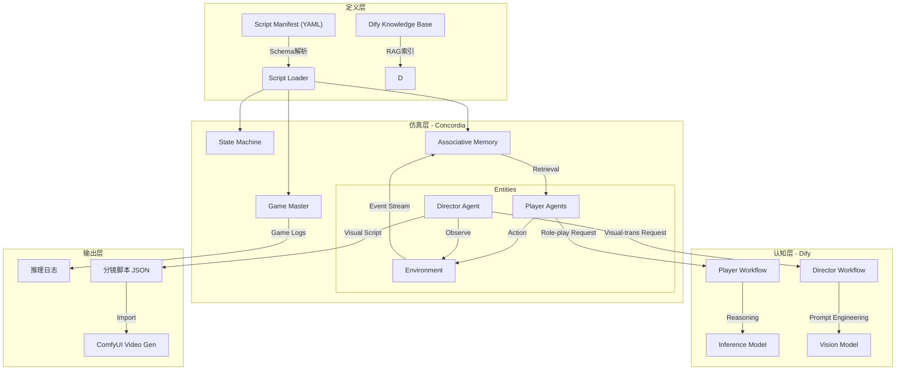

这是整合了 **Concordia 核心职责** 与 **Auto-Director 视觉生成系统** 的完整版技术文档。

---

# 通用剧本杀自动化引擎 (Universal ScriptKill Engine) 技术文档

**版本**: v5.0 (Full-Stack Edition)
**代号**: "PuppetMaster & Director"
**核心栈**: Concordia (仿真/记忆) + Dify (认知/导演) + YAML (定义) + ComfyUI (视觉流)

---

## 1. 项目愿景与技术目标

本项目旨在构建一个**图灵完备的剧本杀演绎与生成引擎**。它不仅是一个能够自动演绎任意剧本的推理系统，更是一个**自动化短片生产流水线**。

通过解耦“逻辑”、“认知”与“视觉”，引擎能够读取标准化的 YAML 剧本配置，通过调度 AI Agent 自动完成游戏流程，并实时输出用于视频生成的结构化分镜脚本。

### 核心技术指标
1.  **逻辑解耦**: 引擎代码 (Python) 与 剧本内容 (YAML) 完全分离。
2.  **认知外包**: 推理、对话决策下放给 Dify 推理 App。
3.  **双层记忆**: 利用 Concordia 的关联记忆解决长剧本遗忘问题。
4.  **视觉转译**: 引入“AI 导演”角色，将剧情实时转译为 Stable Diffusion/ComfyUI 提示词。

---

## 2. 系统架构设计 (System Architecture)



---

## 3. 标准剧本定义协议 (The Universal Protocol)

### 3.1 根结构与全局配置
```yaml
meta:
  id: "case_x_universal"
  name: "通用剧本示例"
  version: "2.0"

# 知识库映射
knowledge_config:
  dataset_id: "dify-dataset-uuid"
  tag_strategy: "prefix_match"

# 新增：视觉风格定义 (Director 的核心输入)
visual_style:
  base_prompt: "Cinematic, Film Noir, 1940s detective movie style, high contrast, volumetric lighting, 8k, masterpiece"
  negative_prompt: "cartoon, anime, low quality, blurry, text, watermark, bad anatomy"

  # 角色外观映射 (保持人物一致性)
  character_appearance:
    char_a: "A 25-year-old female police officer, short black hair, sharp eyes, wearing a dark blue uniform"
    char_b: "A 40-year-old man, messy beard, wearing a ragged grey coat, looking nervous"

  # 场景外观映射
  scene_appearance:
    living_room: "A messy vintage living room, old wooden furniture, dim yellow light from a lamp"
    police_station: "Cold blue lighting, interrogation room, metal table, concrete walls"
```

### 3.2 角色与认知配置 (Characters)
```yaml
characters:
  - id: "char_a"
    name: "张三"
    profile: "心理医生，冷静，实际上是连环杀手。"
    private_knowledge_tag: "【张三专属】"
    objectives:
      - "隐藏杀手身份"
      - "误导其他人怀疑李四"
```

### 3.3 流程状态机 (State Machine)
```yaml
phases:
  - id: "p1_intro"
    type: "SEQUENTIAL_SPEAK"
    label: "自我介绍"
    scene: "living_room" # 指定当前场景，供 Director 使用
    instruction: "请简短介绍自己。"
    next_phase: "p2_discuss"

  - id: "p2_discuss"
    type: "FREE_DISCUSSION"
    label: "自由讨论"
    scene: "living_room"
    duration_turns: 20
    instruction: "讨论现有线索。"
    default_next: "p3_vote"
```

---

## 4. 仿真层实现 (Concordia Simulation Layer)

Concordia 在本架构中不仅是 Agent 的容器，更是**时空与记忆的物理引擎**。

### 4.1 核心组件职责
1.  **Entity Container (实体容器)**:
    *   通过 `PlayerAgent` 类封装 Dify 接口，赋予 AI “身体”。
    *   维护 Agent 的物理状态（如：位置、持有物品）。
2.  **Associative Memory (关联记忆)**:
    *   **核心功能**: 内置向量数据库。
    *   **工作流**: 所有的对话、动作都会被 Embedding 并存入记忆流。当 Agent 需要发言时，Concordia 自动检索最相关的历史记忆，解决 Dify 上下文窗口限制。
3.  **Environment (环境模拟)**:
    *   **Time**: 管理回合与时间流逝。
    *   **Space**: 管理消息广播范围（全场可见 vs 私聊）。

### 4.2 Auto-Director (自动化导演系统)
这是为了视频生成新增的核心模块。

```python
class DirectorAgent(concordia.agents.Entity):
    """
    旁观者 Agent，不参与游戏，只负责将剧情转化为分镜脚本。
    """
    def __init__(self, visual_config, dify_client):
        self.visual_config = visual_config
        self.dify_client = dify_client
        self.buffer = []

    def observe(self, event):
        """监听游戏事件流"""
        # 过滤掉系统指令，只关注剧情相关的内容
        if event.type in ['SPEECH', 'ACTION']:
            self.buffer.append(event)

        # 策略：每积累 3 句对话或场景切换时，生成一组分镜
        if self.should_generate():
            self.generate_visual_script()

    def generate_visual_script(self):
        """调用 Dify Director Workflow"""
        dialogue_chunk = format_dialogue(self.buffer)
        current_scene = self.game_master.current_scene

        # 调用 Dify
        result = self.dify_client.query_director(
            base_style=self.visual_config['base_prompt'],
            neg_prompt=self.visual_config['negative_prompt'],
            char_map=self.visual_config['character_appearance'],
            scene_desc=self.visual_config['scene_appearance'][current_scene],
            dialogue_text=dialogue_chunk
        )

        # 写入结构化日志
        self.log_writer.write(result)
        self.buffer = []
```

---

## 5. 认知层设计 (Dify Cognitive Layer)

我们需要建立**两个**独立的 Dify App (Workflow)。

### 5.1 Player Reasoner (通用推理器)
*   **职责**: 扮演游戏角色，进行推理和对话。
*   **Input**: `role_profile`, `task`, `game_context`, `memory_summary` (来自 Concordia)。
*   **Logic**: RAG 检索私有剧本 -> CoT 推理 -> 生成回复。

### 5.2 Director Studio (通用导演)
*   **职责**: 将文本剧情转译为视觉 Prompt。
*   **Input**:
    *   `dialogue_text`: "张三：我没有杀人！（拍桌子）"
    *   `base_style`: "Cinematic, 1940s..."
    *   `char_map`: JSON 对象，包含所有角色的外貌描述。
    *   `scene_desc`: "A dark living room..."
*   **System Prompt**:
    ```markdown
    # Role
    你是一位电影分镜师。任务是将剧本杀对话转化为 Stable Diffusion 提示词。

    # Rules
    1. 提取对话中的情绪和动作（如“拍桌子”、“愤怒”）。
    2. 使用 `char_map` 中的描述替换角色名字。
    3. 组合 `base_style` + `scene_desc` + `人物动作`。
    4. 保持 Prompt 结构清晰，强调光影和构图。

    # Output Format (JSON)
    {
      "shots": [
        {
          "speaker": "张三",
          "summary": "张三愤怒地拍桌子否认",
          "sd_prompt": "(({{base_style}})), {{scene_desc}}, 1man, {{char_map['张三']}}, slamming table, angry expression, shouting, dynamic angle, depth of field",
          "audio_text": "我没有杀人！"
        }
      ]
    }
    ```

---

## 6. 输出产物与工作流 (Output & Workflow)

引擎运行结束后，将产出两份核心数据：

1.  **Game Replay Log (文本)**: 完整的推理过程、凶手指认结果。
2.  **Visual Script (JSON)**: 用于视频生成的中间文件。

### 6.1 Visual Script 示例
```json
[
  {
    "id": 101,
    "timestamp": "00:05:20",
    "scene": "living_room",
    "shot_type": "medium_shot",
    "sd_positive": "Cinematic, 1940s style, A messy vintage living room, 1woman, A 25-year-old female police officer, dark blue uniform, looking suspicious, holding a magnifying glass, rim lighting",
    "sd_negative": "cartoon, anime, bad hands...",
    "subtitle": "我觉得这个烟灰缸的位置不对劲。",
    "audio_source": "tts_char_a_05.wav"
  }
]
```

### 6.2 后期接入 (Manual/ComfyUI)
开发者可以使用简单的 Python 脚本读取上述 JSON，批量调用 ComfyUI API：
1.  遍历 JSON 列表。
2.  将 `sd_positive` 发送给 ComfyUI 的 Text2Img/Video 节点。
3.  (可选) 将 `subtitle` 发送给 TTS 节点生成语音。
4.  将生成的视频/图片按顺序拼接。

---

## 7. 关键技术难点与解决方案

### 7.1 角色一致性 (Character Consistency)
*   **问题**: 生成的视频里，同一个角色在不同镜头长得不一样。
*   **方案**:
    *   在 YAML `character_appearance` 中写死非常详细的特征描述。
    *   在 ComfyUI 侧，建议结合 **IP-Adapter** 或 **LoRA** 技术。Director Agent 生成的 Prompt 只是基础，ComfyUI 工作流中应包含对应角色的 IP-Adapter 节点来锁定人脸。

### 7.2 记忆检索的准确性
*   **问题**: Concordia 检索回来的记忆可能包含干扰信息。
*   **方案**: **Re-ranking (重排序)**。在 Concordia 检索出 Top-10 记忆后，不直接给 Dify，而是先通过一个轻量级模型（或 Dify 内部步骤）进行相关性评分，只保留 Top-3。

### 7.3 导演的“镜头感”
*   **问题**: 生成的画面全是“大头照”。
*   **方案**: 在 Director 的 Prompt 中随机或逻辑性地加入镜头语言词汇（如 `wide shot`, `close up`, `over the shoulder shot`）。可以在 YAML 中配置“镜头策略”，例如：对话激烈时用 `close up`，场景切换时用 `wide shot`。

---

## 8. 总结

本架构通过 **Concordia** 实现了严谨的时空与记忆管理，通过 **Dify** 实现了灵活的推理与导演能力，并通过 **YAML** 实现了剧本的标准化定义。

最终，它不仅能跑通剧本杀，还能自动产出一份高质量的、包含详细 Prompt 的分镜脚本，为您后续的 ComfyUI 视频制作提供完美的“半成品”素材。
